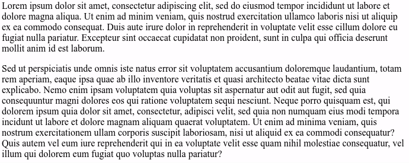
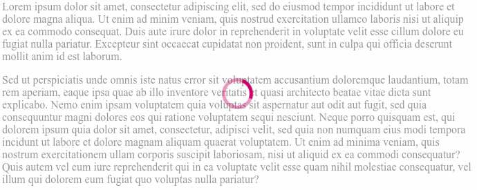

# css-only-loaders

This is a collection of single element loaders animated with CSS.

The aim of this little project was to play with css animations by creating a set of loaders consisting of single html element.

Each loader can be configured (size, color) and it can be displayed as:
* a standalone element (default)
* over a parent div (by adding `.on-element` class)
* over a full page (by adding `.full-page` class)

## Usage

To add a loader simply create an `html` element with class `.loader` and add an extra class for specific loader type.
For example to render loader bar you could write:
```
<div class="loader loader-bar"></div>
```

#### Cover whole page
To display full page loader add `.full-page` class to the element. For example:
```
<div class="loader loader-default full-page"></div>
```

#### Cover single element
To cover relatively positioned parent with the loader add `.on-element` class to loader element. For example:
```
<div class="loader loader-default on-element"></div>
```

Example:

`div` with text content


`div` with text content covered with loader


    
## Loader Types

| name | css class name | example usage | how it looks |
| --------------- | ---------------- | ---------------- | ---------------- |
| default | `loader-default` | `<div class="loader loader-default"></div>` |  |
| bar | `loader-bar` | `<div class="loader loader-bar"></div>` |  |
| dots | `loader-dots` | `<div class="loader loader-dots"></div>` |  |
| spinner | `loader-spinner` | `<div class="loader loader-spinner"></div>` |  |
| pulsate | `loader-pulsate` | `<div class="loader loader-pulsate"></div>` |  |
| heartbeat | `loader-heartbeat` | `<div class="loader loader-heartbeat"></div>` |  |
| circles | `loader-circles` | `<div class="loader loader-circles"></div>` |  |
| progress | `loader-progress` | `<div class="loader loader-progress"></div>` |  |
    
    
## Config and build

### Build
To build minified css file with updated configuration run command:
```
npm run build
```
When it completes you should have a minified `loaders.css` file in your directory.

### Build single loaders
TODO
    
### Customization
All the variables regarding loader sizes and colors are located in `base.scss` file.
You can set specific colors and sizes for each loader type
and/or you can change the colors of all loaders by changing the value of `$mainColor` variable (in `base.scss` file).

Sample configuration:
```sass
$mainColor: rgba(200, 0, 105, 1);

...

// Heartbeat loader
$heartbeat-size: 30px;
$heartbeat-color: $mainColor;
$heartbeat-time: 1.35s;
```

## License
MIT License
